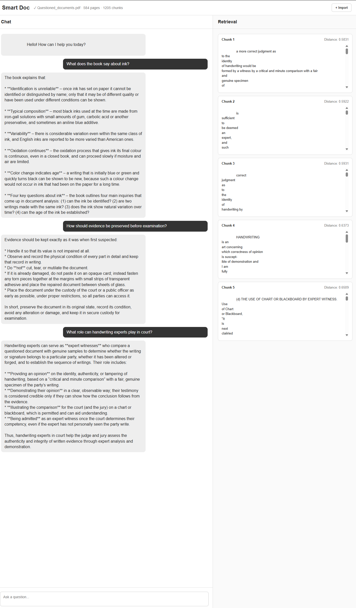

# Smart_Doc

A local Retrieval-Augmented Generation (RAG) application for querying PDF and text documents.

## Demo



## Features

- PDF and plain-text document import
- OCR fallback for scanned PDFs using Tesseract
- Recursive text chunking
- Sentence Transformer embeddings
- ChromaDB vector storage and semantic retrieval
- Local LLM inference with Ollama
- Top 5 retrieved chunks displayed alongside responses
- Chat-based web interface

## Architecture

```text
Document
   ↓
Text Extraction / OCR
   ↓
Chunking
   ↓
Embeddings
   ↓
ChromaDB
   ↓
User Question
   ↓
Query Embedding
   ↓
Semantic Retrieval
   ↓
Top 5 Chunks
   ↓
Ollama
   ↓
Generated Answer
```

## Tech Stack

- Python
- FastAPI
- PyMuPDF
- Tesseract OCR
- LangChain Text Splitters
- Sentence Transformers
- ChromaDB
- Ollama
- HTML / CSS / JavaScript

## Running Locally

Start the FastAPI backend:

```bash
uvicorn app:app --reload
```

Start the frontend:

```bash
python -m http.server 5500
```

Then open:

`http://127.0.0.1:5500/smart_doc_ui/`

Ollama must also be running locally with the configured model.

## Purpose

This project was built as a hands-on implementation of a RAG pipeline, with the retrieval process exposed in the UI to make the relationship between retrieved context and generated answers visible.
